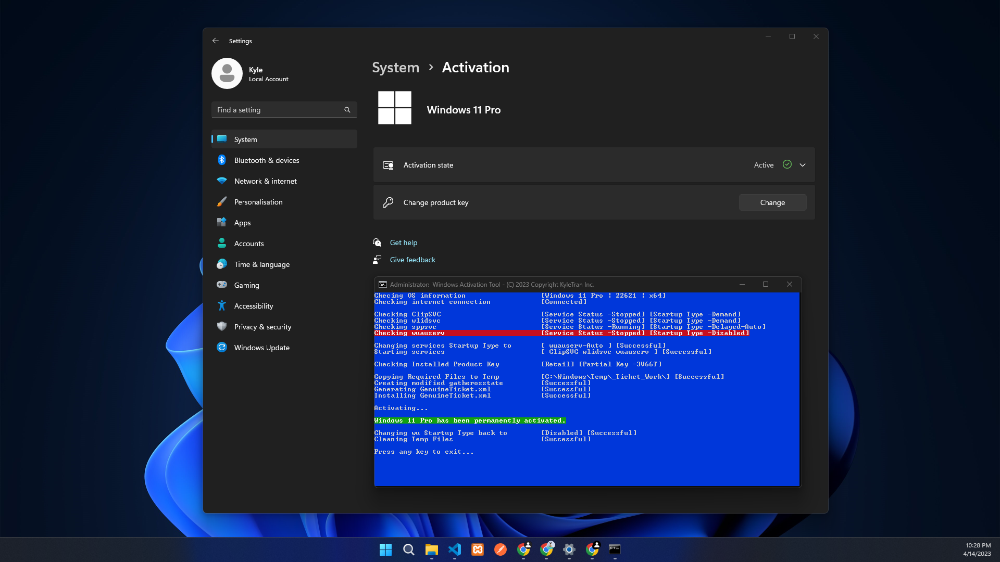
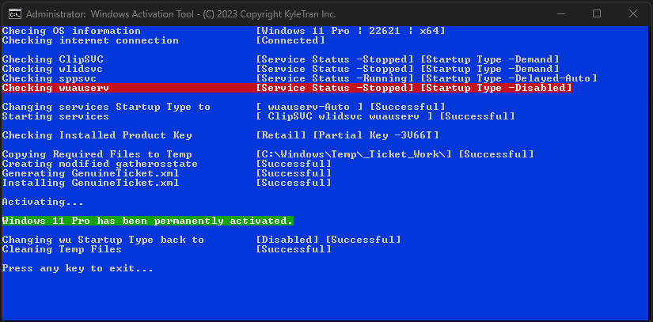

  
  
  
  
  

  
  
  </a>

<h2>Features</h2>
<i><b>Support All Windows Version</b></i>
<h2>Installation</h2>
<i>git clone https://github.com/kyletran191/active_windows.git</i> 
<i><b>Now go to run `active_windows.cmd` by the administrator</b></i>
<h2>Preview</h2>

